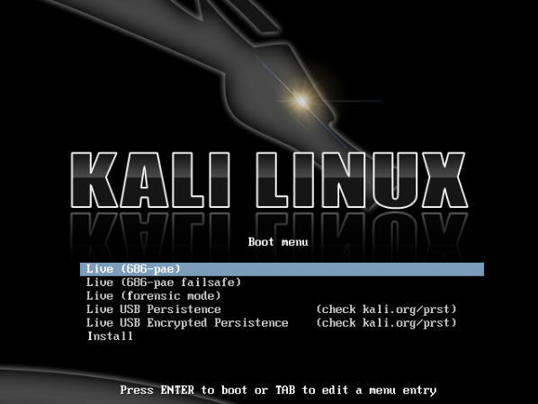

# 第一章 配置无线环境

> 作者：Vivek Ramachandran, Cameron Buchanan

> 译者：[飞龙](https://github.com/)

> 协议：[CC BY-NC-SA 4.0](http://creativecommons.org/licenses/by-nc-sa/4.0/)

## 简介

> 如果我要在八个小时之内砍倒一棵树，我会花六个小时来磨我的斧子。

> -- 亚伯拉罕·林肯，第 16 任美国总统

在每次成功的渗透测试背后，是数小时或者数天的准备，无线渗透测试也不例外。这一章中，我们会创建无线环境，我们在这本书中会将其用于实验。在你进行真实世界的渗透测试之前，将这个环境看做你的舞台吧。

无线渗透测试是个实践性的东西，首先配置环境，使你可以在安全和可控的环境下，尝试这本书中所有不同的实验非常重要。在继续下去之前，必须要首先配置这个实验环境。

### 硬件要求

我们需要满足下列硬件配置来建立无线环境。

+   两个带有内置 WiFi 网卡的笔记本：我们会使用一台笔记本作为受害者，另一台作为渗透测试者。虽然多数笔记本都满足要求，推荐笔记本需要至少有 3GB 的 RAM。这是因为我们可能会在笔记本上运行大量内存密集型软件。

+   一个无线适配器（可选）：取决于笔记本上的无线网卡，你可能需要支持封包注入和封包嗅探的 USB wifi 网卡。最佳选择是  Alfa Networks 的 Alfa AWUS036H，因为 Kali 自带它的支持。这本书编写时，它在亚马逊上卖 £18。替代选项是 EW-7711UAN，它更小而且更便宜。

+   一个接入点：一个支持 WEP/WPA/WPA2 加密标准的接入点就满足要求了。出于演示目的，我会使用  TP-LINK TL-WR841N 无线路由器。在本书编写时，你可以在亚马逊上花 £20 购买它。

+   互联网连接：这在执行搜索、下载软件和执行一些实验时有帮助。

### 软件要求

我们需要下列软件来配置无线环境：

+   Kali：这个软件可以从官网上下载：`http://www.kali.org`。这个软件是开源的，你应该能直接在官网上下载。

+   Windows XP/Vista/7：你需要他们质疑，安装在另一台笔记本上。本书的剩余部分中，这个笔记本用做受害者主机。

>   要注意，即使我们使用了基于 Windows 的OS，我们所学的技巧也能应在任何支持 WiFi 的设备上，例如智能手机、平板，以及其它。

## 1.1 安装 Kali

让我们现在快速浏览如何安装并运行 Kali。

Kali 会安装在笔记本上，在本书的剩余部分，它会作为渗透测试者的主机。

### 实践时间 -- 安装 Kali

Kali 相对易于安装。我们会通过将它启动为 Live DVD 来运行 Kali，之后安装在硬盘上。

逐步执行下列指南：

在可启动的 DVD 上烧录你下载的 Kali ISO。

1.  使用这个 DVD 启动笔记本，并从选择`Boot Menu`选择`Install`。

    
    
2.  如果启动成功，你会看到一个非常棒的复古界面，像这样：

    
    
3.  安装器类似于大多数 Linux 系统的基于 GUI 的安装器，并且用起来应该很简单。在每个界面上选择合适的选项，并开始安装过程。安装完成之后，按照提示重启主机并取出 DVD。

4.  主机重启之后，会显示登录屏幕。输入`root`作为登录名，安装密码是安装过程中你设置的东西。你现在应该能够登录进你安装的 Kali。恭喜！

    我在这本书中会修改桌面主题和一些设置。你可以随意使用你自己的主题和颜色配置。
    
### 刚刚发生了什么？

我们已经成功将 Kali 安装到笔记本上。我们会将这台笔记本作为渗透测试者的主机，并用于本书的所有实验。

### 试一试 -- 将 Kali 安装到 VirtualBox

我们也可以将 Kali 安装到虚拟机中，例如 VirtualBox。如果你不想把整台笔记本都刷成 Kali，这是最佳选项。Kali 在 VirtualBox 中的安装过程一模一样。唯一的区别就是预启动，你需要创建在 VirtualBox 中。试试它吧。你可以从`http://www.virtualbox.org`下载 VirtualBox。

我们可以安装并使用 Kali 的其它方式之一就是通过 USB 驱动。如果你不想将它安装到硬盘上，但是仍然想在你的 Kali 实例上持久储存数据，例如脚本和新的工具，这会很有帮助。我们推荐你也试试它。
