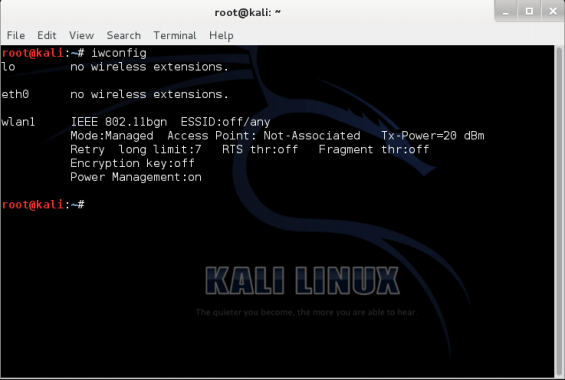
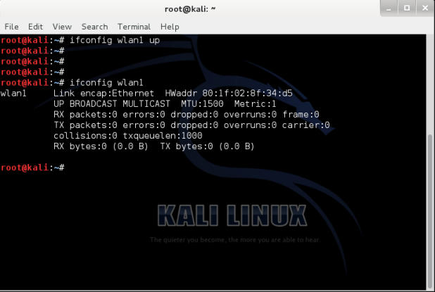
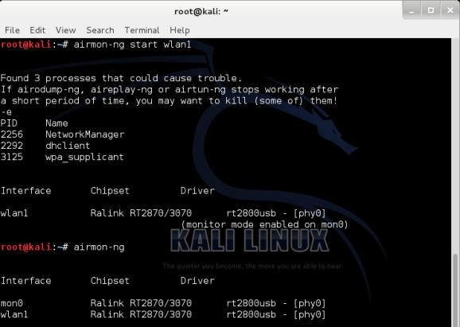
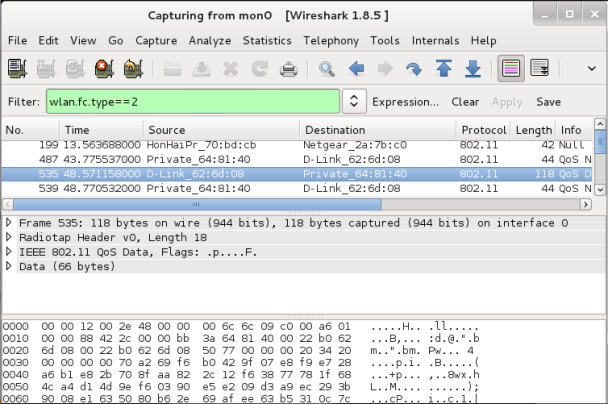

# 第二章 WLAN 和固有的不安全性

> 作者：Vivek Ramachandran, Cameron Buchanan

> 译者：[飞龙](https://github.com/)

> 协议：[CC BY-NC-SA 4.0](http://creativecommons.org/licenses/by-nc-sa/4.0/)

## 简介

> 建筑越高，地基就要打得越深。

> -- 托马斯·坎佩斯

没有什么伟大的东西能在脆弱的基础上构建。在我们的语境中，固有的不安全性之上不能构建出安全。

WLAN 在设计上拥有特定的不安全性，它们可被轻易利用，例如，通过封包注入，以及嗅探（能够在很远处进行）。我们会在这一章利用这些缺陷。

## 2.1 回顾 WLAN 帧

由于这本书处理无线方面的安全，我们假设你已经对协议和封包的头部有了基本的了解。没有的话，或者你离开无线有很长时间了，现在是个好机会来回顾这个话题。

让我们现在快速复习一些 WLAN 的基本概念，大多数你可能已经知道了。在 WLAN 中，通信以帧的方式进行，一帧会拥有下列头部结构：


`Frame Control`字段本身拥有更复杂的结构：


类型字段定义了下列三种 WLAN 帧：

1.  管理帧：管理帧负责维护接入点和无线客户端之间的通信。管理帧拥有下列子类型：

    +   验证
    +   解除验证
    +   关联请求
    +   关联响应
    +   重关联请求
    +   重关联响应
    +   解除关联
    +   信标
    +   探测请求
    +   探测响应
    
2.  控制帧：控制帧负责确保数据在接入点和无线客户端之间合理交换。控制帧拥有下列子类型：

    +   请求发送（RTS）
    +   清除发送（CTS）
    +   确认（ACK）
    
3.  数据帧：数据帧携带在无线网络上发送的真实数据。它没有子类型。

我们在之后的章节中讨论不同攻击的时候，会讨论这些帧中每一种的安全隐患。

我们现在看一看如何使用 Wireshark 嗅探无线网络上的这些帧。也有其他工具 -- 例如 Airodump-NG，Tcpdump，或者 Tshark -- 你同样可以用于嗅探。我们在这本书中多数情况会使用 Wireshark，但是我们推荐你探索其它工具。第一步是创建监控模式的接口。这会为你的适配器创建接口，使我们可以读取空气中的所有无线帧，无论它们的目标是不是我们。在有线的世界中，这通常叫做混合模式。

### 实战时间 -- 创建监控模式的接口

让我们现在将无线网卡设为监控模式。

遵循下列指南来开始：

1.  启动 Kali 并使适配器保持连接。一旦你打开了控制台，输入`iwconfig`并确保网卡被检测到，驱动被正确加载。

    
    
2.  使用`ifconfig wlan1 up`命令启动网卡（其中`wlan1`是你的适配器）。通过运行`ifconfig wlan1`验证网卡是否正在运行。你应该在输出的第二行看到单词`UP`，像这样：

    
    
3.  为了将网卡设为监控模式，我们使用`airmon-ng `，它在 Kali 中自带。首先执行`airmon-ng `命令来确认它检测到了可用的网卡。你应该能看到输出中列出的`wlan1`接口：

    
    
4.  现在输入`airmon-ng start wlan1 `命令来创建对应`wlan1`设备的监控模式接口。新的监控模式接口名为`mon0`。（你可以再次不带参数使用`airmon-ng `来验证。）

    
    
5.  同样，运行`ifconfig mon0`会展示叫做`mon0`的新接口。

### 刚刚发生了什么？

我们成功创建了叫做`mon0`的监控模式接口。这个接口用于嗅探空气中的无线封包。这个接口已经在我们的无线适配器中创建了。

### 试一试 -- 创建多个监控模式接口

可以创建多个监控模式的接口，使用相同的物理网卡。使用 airmon-ng 工具来看看如何完成。

太棒了！我们拥有了监控模式接口，等待从空气中读取一些封包。所以让我们开始吧。

下一个练习中，我们会使用 Wireshark 和刚刚创建的`mon0`监控器模式接口，从空气中嗅探封包。

### 实战时间 -- 嗅探无线封包

遵循下列指南来开始：

1.  启动我们在第一章中配置好的接入点`Wireless Lab `。

2.  通过在控制台中键入` Wireshark & `来启动 Wireshark，一旦 Wireshark 运行，访问`Capture | Interfaces`。

    
    
3.  通过点击`Start`按钮从`mon0`接口选择封包捕获，像截图中那样。Wireshark 会开始捕获，现在你可以在 Wireshark 窗口中看到封包。

    

4.  这些就是你的无线适配器从空气中嗅探到的封包。为了查看任何封包，在上面的窗口中选择它，中间的窗口中会展示整个封包：

    
    
    点击`IEEE 802.11 Wireless LAN management frame`前面的三角形来展开并查看详细信息。
    
观察封包中不同的头部字段，并将它们和之前了解的 WLAN 帧类型以及子类型关联。

### 刚刚发生了什么？

我们刚刚从空气中嗅探了第一组封包。我们启动了 Wireshark，它使用我们之前创建的监控模式接口`mon0`。通过查看 Wireshark 的底部区域，你应该注意到封包捕获的速度以及目前为止捕获的封包数量。

### 试一试 -- 发现不同设备

Wireshark 的记录有时会令人生畏，即使在构成合理的无线网络中，你也会嗅探到数千个封包。所以深入到我们感兴趣的封包十分重要。这可以通过使用 Wireshark 中的过滤器来完成。探索如何使用这些过滤器来识别记录中唯一的无线设备 -- 接入点和无线客户端。

如果你不能做到它，不要着急，它是我们下一个要学的东西。

### 实战时间 -- 查看管理、控制和数据帧

现在我们学习如何使用 WIreshark 中的过滤器来查看管理、控制和数据帧。

请逐步遵循下列指南：

1.  为了查看捕获的封包中的所有管理帧，在过滤器窗口中输入过滤器`wlan.fc.type`，并点击`Apply`。如果你打算防止封包向下滚动过快，你可以停止封包捕获。

    
    
2.  为了查看控制帧，将过滤器表达式修改为`wlan.fc.type == 1`。

    
    
3.  为了查看数据帧，将过滤器表达式修改为`wlan.fc.type == 2`。

    
    
4.  为了额外选择子类型，使用`wlan.fc.subtype`过滤器。例如，要查看所有管理帧中的信标帧，使用下列过滤器：

    ```
    (wlan.fc.type == 0) && (wlan.fc.subtype == 8)
    ```
    
    
    
5.  作为替代，你可以在中间的窗口中右击任何头部字段，之后选择`Apply as Filter | Selected`来使用过滤器。

    
    
6.  这会自动为你在`Filter`字段中添加正确的过滤器表达式。

### 刚刚发生了什么？

我们刚刚学习了如何在 Wireshark 中，使用多种过滤器表达式来过滤封包。这有助于监控来自我们感兴趣的设备的所选封包，而不是尝试分析空气中的所有封包。

同样，我们也可以以纯文本查看管理、控制和数据帧的封包头部，它们并没有加密。任何可以嗅探封包的人都可以阅读这些头部。要注意，黑客也可能修改任何这些封包并重新发送它们。协议并不能防止完整性或重放攻击，这非常易于做到。我们会在之后的章节中看到一些这类攻击。

### 试一试 -- 玩转过滤器

你可以查阅 Wireshark 的手册来了解更多可用的过滤器表达式，以及如何使用。尝试玩转多种过滤器组合，直到你对于深入到任何细节层级都拥有自信，即使在很多封包记录中。

下个练习中，我们会勘察如何嗅探我们的接入点和无线客户端之间传输的数据封包。
