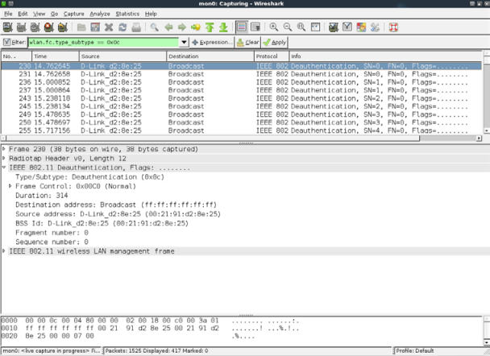
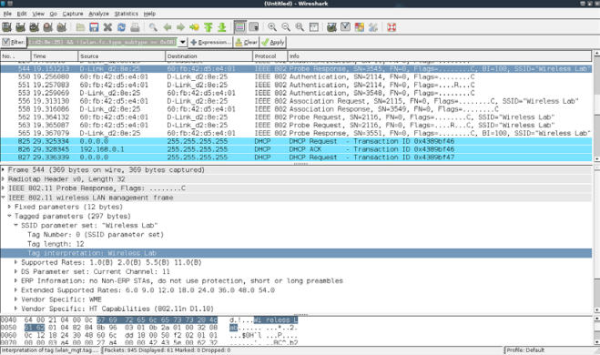
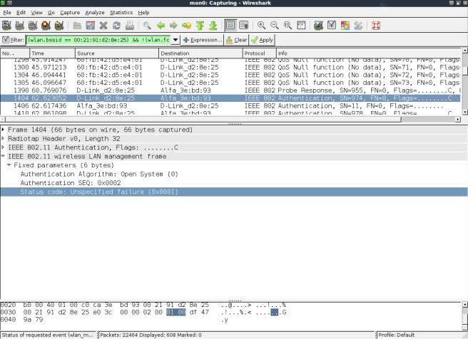
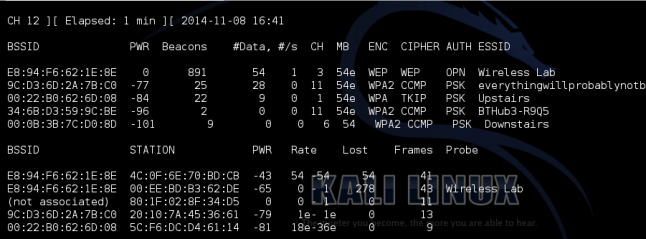

# 第三章 绕过 WLAN 身份验证

> 作者：Vivek Ramachandran, Cameron Buchanan

> 译者：[飞龙](https://github.com/)

> 协议：[CC BY-NC-SA 4.0](http://creativecommons.org/licenses/by-nc-sa/4.0/)

## 简介

> 安全的错觉比不安全更加糟糕。

> -- 佚名

安全的错觉比不安全更加糟糕，因为你不可能为面对被黑的可能性做准备。

WLAN 的身份验证模式可能很弱，可以被破解和绕过。这一章中，我们会查看一些 WLAN 中所使用的基本的身份验证模式，以及学习如何破解它们。

## 3.1 隐藏的 SSID

在默认的配置模式下，所有接入点都在信标帧中发送它们的 SSID。这让附近的客户端能够轻易发现它们。隐藏 SSID 是个配置项，其中接入点并不在信标帧中广播它的 SSID。因此，只有知道接入点 SSID 的客户端可以连接它。

不幸的是，这个方法不能提供可靠的安全，但是网络管理员认为它很安全。隐藏 SSID 不应该被看作安全手段。我们现在来看看如何发现隐藏的 SSID。

### 实践时间 -- 发现隐藏的 SSID

执行下列指南以开始：

1.  使用 Wireshark，如果我们监控` Wireless Lab`网络中的信标帧信标帧，我们就能够以纯文本查看 SSID。你应该能看到信标真，像这样：

    
    
2.  配置你的接入点来隐藏` Wireless Lab`网络的 SSID。这个配置项在不同接入点中可能不同。这里，我需要检查`Visibility Status `选项的`Invisible `选项，像这样：

    
    
3.  现在如果你查看 Wireshark 的记录，你会发现` Wireless Lab`的 SSID从信标帧中消失了。这是隐藏 SSID 所做的事情：

    

4.  为了绕过信标帧，我们首先使用被动技巧来等待正常客户端连接到接入点。这会生成探测请求和响应，它包含网络的 SSID，从而揭示它的存在。

    
    
5.  作为替代，你可以使用`aireplay-ng `来发送接触验证封包给所有代表`Wireless Lab`接入点的路由器，通过输入：` aireplay-ng -0 5 -a <mac>  --ignore-negative mon0`，其中`<mac>`是路由器的 MAC 地址。`-0`选项用于选则接触验证攻击，`5`是要发送的封包数量。最后，`-a`指定了所定位的接入点的 MAC 地址。

    
    
6.  接触验证的过程会强迫所有正常客户端断开连接并重连。为接触验证的封包添加个过滤来单独查看它们是个好主意。

    
    
7.  来自接入点的探测响应最后会发现 SSID。这些封包会出现在 Wireshark 中。一旦正常客户端连接回来了，我们就可以通过探针的请求和响应帧来查看隐藏的 SSID。可以使用过滤器` (wlan.bssid == 00:21:91:d2:8e:25) && !(wlan.fc.type_subtype == 0x08) `来监控所有发往或来自接入点的非信标封包。`&&`符号代表逻辑 AND 操作符，`!`符号代表逻辑 NOT 操作符：

    
    
### 刚刚发生了什么？

即使 SSID 隐藏而且不广播，当正常的客户端尝试连接到接入点时，它们就交换了探测请求和响应的封包。这些封包包含接入点的 SSID。由于这些封包没有加密，它们可以被非常轻易地嗅探来发现SSID 。

我们在之后的章节中会出于其它目的，例如跟踪，涉及到探测请求。

许多情况下，所有客户端可能已经链接到接入点，并且在 Wireshark 记录中没有探测请求或响应的封包。这里，我们可以强制客户端断开接入点的链接，通过发送伪造的解除验证封包。这些封包会强迫客户端重新连接到接入点上，从而获取 SSID。

### 试一试 -- 选择解除验证

在之前的练习中，我们广播了解除验证封包来强制所有无线客户端重新连接。尝试验证如何使用`aireplay-ng`工具，选择性对某个客户端执行它。

要注意，即使我们使用 Wireshark 演示了许多概念，但也可以使用其它工具来完成攻击，例如`aircrack-ng`套件。我们推荐你探索整个 aircrack-NG 套件以及其它位于官网的文档：` http://www.aircrack-ng.org`。

## 3.2 MAC 过滤器

MAC 过滤器是个古老的技巧，用于验证和授权，它们根植于有线世界。不幸的是，它们在无线世界中变得十分糟糕。

最基本的想法就是基于客户端的 MAC 地址进行验证。MAC 过滤器是为网络接口分配的一段识别代码，路由器能够检查这个代码并将其与允许的 MAC 列表进行比较。允许的 MAC 地址列表由网络管理员维护，储存于接入点中。我们现在要看看绕过 MAC 过滤器有多容易。

### 实践时间 -- 绕过 MAC 过滤器

让我们遵循以下指南来开始：

1.  让我们首先配置我们的接入点来使用 MAC 过滤，之后添加受害者笔记本的客户端 MAC 地址。我的路由器上的设置页面是这样：

    
    
2.  一旦开启了 MAC 过滤，只有允许的 MAC 地址能够成功被接入点验证。如果我们尝试从不在 MAC 地址白名单中的机器连接接入点，就会失败。

3.  在这个场景背后，接入点发送验证失败的消息给客户端。封包记录像这样：

    
    
4.  为了绕过 MAC 过滤器，我们可以使用`airodump-ng`来寻找连接到接入点的客户端 MAC 地址。我们可以通过输入` airodumpng -c 11 -a --bssid <mac> mon0 `命令。通过指定`bssid`命令，我们只监控接入点，这是我们所感兴趣的。`-c 11`命令将频道设置为接入点所在的`11`。`-a`命令确保在`airodump-NG `输出的客户端部分中，只展示相关客户端，以及到接入点的连接。这会向我们展示所有和接入点相关的客户端 MAC 地址。

    
    
5.  一旦我们找到了白名单中的客户端 MAC 地址，我们可以使用`macchanger`工具来修改客户端的 MAC 地址，Kali自带这个工具。你可以使用` macchanger –m <mac> wlan0 `命令来完成。你使用`-m`命令指定的 MAC 地址就是`wlan0`接口的新 MAC 地址。

    
    
6.  你可以看到，将 MAC 地址修改为白名单客户端之后，我们现在能够连接接入点了。

### 刚刚发生了什么？

我们使用`airodump-ng `监控了流量，找到了连接到无线网络的正常用户的 MAC 地址。之后我们可以使用`macchanger `工具来修改无线网卡的 MAC 地址，与客户端保持一致。这会欺骗接入点，使其相信我们是正常耳朵客户端，它会允许我们访问它的无线网络。

我们鼓励你探索`airodump-NG`工具的不同选项，通过访问官网的文档：` http://www.aircrack-ng.org/doku. php?id=airodump-ng`。
