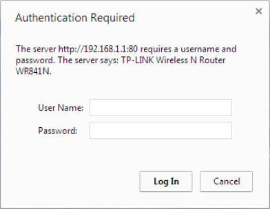
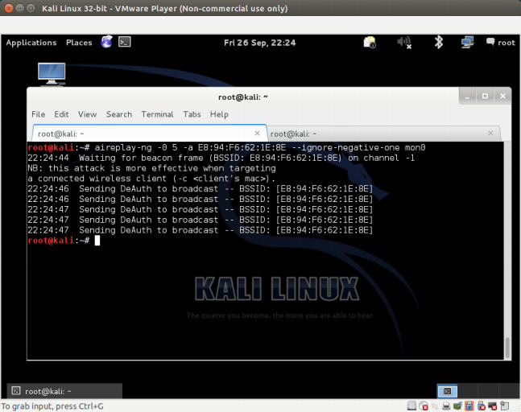
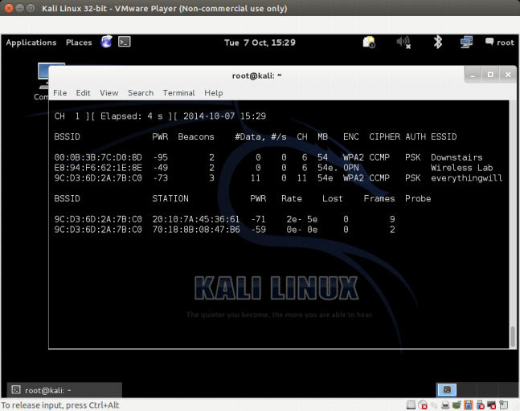
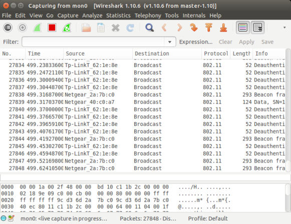
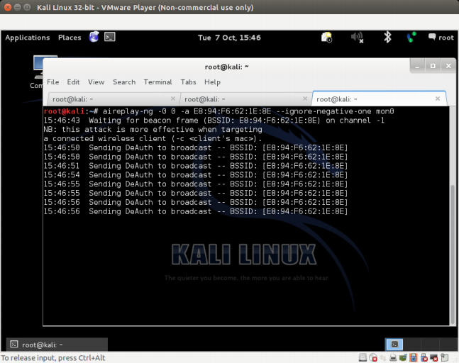

# 第五章 攻击 Web 设施

> 作者：Vivek Ramachandran, Cameron Buchanan

> 译者：[飞龙](https://github.com/)

> 协议：[CC BY-NC-SA 4.0](http://creativecommons.org/licenses/by-nc-sa/4.0/)

## 简介

> 故上兵伐谋

> -- 孙子，《孙子兵法》

这一章中，我们会攻击 WLAN 设施的核心。我们会专注于如何使用不同的新型攻击向量和引诱性的授权客户端，来作为攻击者渗透授权网络。

## 5.1 接入点的默认账户和身份

WLAN 接入点是设施的核心部分。即使它们起到重要作用，它们有时候在安全上会被忽视。这个练习中，我们会检查是否修改了接入点的默认密码。之后，我们会验证，即使密码修改了，它们是否易于使用基于字典的攻击猜测和破解。

要注意，因为我们来到了更高级的章节，我们就假设你已经浏览了前面的章节，现在熟悉了所有这里所讨论的工具的使用。这允许我们构建在这些知识智商，并尝试更加复杂的攻击。

### 实战时间 -- 破解接入点的默认账户

遵循以下指南来开始：

1.  让我们首先连接到`Wireless Lab `接入点，并尝试访问 HTTP 管理界面。我们会看到接入点模型是`TP-Link WR841N`，像这样：

    
    
2.  从厂商的网站中，我们找到了管理员的默认账户是`admin`。我们在登录页面上尝试它，并且我们成功登录。这展示了攻破使用默认身份的账户有多容易。我们强烈推荐你获得路由器的在线用户手册。这会允许你理解在渗透测试过程中应该怎么做，以及向你提供其它配置缺陷的洞察。

    
    
### 刚刚发生了什么？

我们验证了这个接入点上的默认密码没有改动，这会让整个网络沦陷。同样，即使默认身份被改动，结果也可能是一些易于猜测或执行字典工具的东西。

### 试一试 -- 使用爆破来破解账户

在上一个练习中，将密码修改为一些难以猜测或在字典中找到的东西，并看看你是否能够使用爆破的手段攻破它。限制密码的长度和字符，以便你可能会成功。用于破解 HTTP 验证的工具之一叫做 Hydra，Kali 中自带。

## 5.2 拒绝服务攻击

WLAN 易于受到使用多种技巧的拒绝服务攻击，包括但不仅限于：

+   解除验证攻击

+   接触挂链攻击

+   CTS-RTS 攻击

+   信号或频谱干扰攻击

在这本书中，我们会使用下列实验来讨论无线设施上的杰出验证攻击。

### 实战时间 -- 解除验证 DoS 攻击

遵循以下指南来开始：

1.  将` Wireless Lab `网络配置为使用开放验证，没有任何加密。这会允许我们更易于使用 Wireshark 查看封包。

    
    
2.  让我们将 Windows 客户端连接到接入点。我们会在`airodump-ng `的界面中看到连接：

    
    
3.  现在，在攻击者的主机上，让我们对其执行直接的解除验证攻击。

    
    
4.  要注意，客户端现在完全断开了接入点的连接。我们可以在`airodump-ng`界面上验证它。

    
    
5.  如果我们使用 Wireshark 来查看流量，你会注意到，我们刚才发送了大量解除验证的封包。

    
    
6.  我们可以代表接入点向整个网络发送广播解除验证封包，来执行相同攻击。这会断开所有客户端的连接：

    
    
### 刚刚发生了什么？

我们成功发送了解除验证封包给接入点和客户端。这会导致它们之间的连接断开和通信丢失。

我们也可以发送广播解除验证封包，这会确保附近没有客户端能成功连接到我们的接入点。

要注意，只要客户端断开了，它会尝试再次连接到接入点，所以解除验证攻击应该持续进行，来产生拒绝服务的效果。

这是最易于构造的攻击但是有毁灭性的效果。这很方便在现实世界中使用，来使无线网络崩溃。

### 试一试 -- 解除关联攻击

尝试弄清如何使用 Kali 上现有工具，对目标设施执行解除关联攻击。你可以发送广播解除关联攻击吗？
